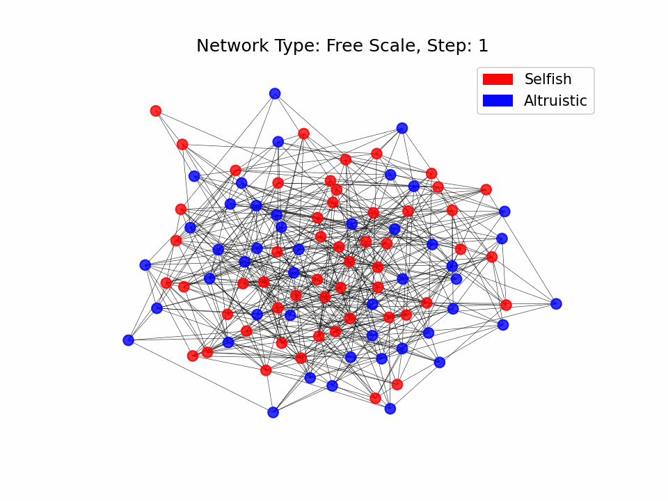

# From Egoism to Altruism

**Palok (Paul) Biswas, Xiaojie Niu**

We investigate the conditions under which a society initially dominated by *selfish (egoist)* individuals can evolve to adopt *altruistic* behaviour as the norm. Inspired by *positive* and *normative* economics concepts, we create an artificial economy initially characterized by egoism and explore how it can transition to one where altruism prevails. We examine factors such as the *initial proportion of altruistic individuals*, *wealth distribution*, and *social network structures*. Two network types are used: *Barabasi-Albert*, which likely clusters of individuals, and Erdos-Renyi, which simulates small-world networks. Some modelled dynamics include *wealth growth,* *trade*, *social influence*, *wealth redistribution by altruists*, and *employment changes*. When approximately 80% of the population in a society adopts a new behavior, we consider that the society has effectively shifted to a new norm.

## Insights from the Literature

##### Network Effects and Social Influence
Liu et al. (2015) demonstrated the direct social influence of generosity and selfishness, finding that while individuals reciprocate generosity, selfish behaviour tends to have a more substantial impact by shaping expectations about future interactions. Fowler and Christakis (2010) found that cooperative behaviour can cascade through social networks, influencing subsequent acts of cooperation up to three degrees of separation. Additionally, Rand et al. (2011) highlighted that dynamic social networks, where individuals frequently update their social connections, sustain high levels of cooperation by enabling cooperators to connect and disconnect from defectors. These findings suggest that network structure and social influence play crucial roles in propagating altruistic behaviours. This will inform our analysis of network dynamics in the Barabasi-Albert and Erdos-Renyi models.

##### Agents Reciprocate if Benefited by Altruism
Trivers (1971) offered a model of reciprocal altruism, showing how psychological traits like trust, sympathy, and guilt regulate altruistic behaviour and deter cheating. In a neurobiological context, Rilling et al. (2002) showed that cooperation activates brain regions associated with rewards, reinforcing reciprocal altruism. Axelrod and Hamilton (1981) demonstrated through game theory and evolutionary models that reciprocity-based cooperation can persist as an evolutionarily stable strategy even in asocial environments. These insights emphasize that individuals are likely to continue altruistic behaviour if they perceive reciprocal benefits, highlighting the importance of psychological and neurobiological factors in facilitating the spread of altruism.

##### Egoism and Altruism May Originate from a Common Motivational Source
Kago and Venkataraman (2023) discussed the blurred lines between altruism and egoism, suggesting that these behaviours may originate from a common motivational source but manifest differently based on context. These findings collectively inform our investigation into the transition from egoism to altruism, emphasizing the roles of social influence, network dynamics, psychological factors, and the potential for cascading behaviours and evolving stable strategies in fostering altruistic norms.

## Key Modelling Assumptions

1. ****Wealth Generation****: Wealth grows at a fixed rate, emulating returns on investment. Salary is proportional to the initial wealth, and expenditure varies between a minimum and maximum expenditure per timestep.

2. ****Trade****: A fixed network structure is used throughout the simulation run. Two network structures are considered: Barabasi-Albert and Erdos-Renyi networks. Agents randomly select a neighbour for trade interactions, reflecting the stochastic nature of market interactions or social exchanges. Trading only occurs when the agent has a positive wealth. During the trade, agents transfer a predefined proportion of their wealth to the selected neighbour, simulating market transactions or resource sharing.

3. ****Sufficiency Threshold****: Agents are considered to have sufficient wealth if their wealth is above a certain threshold. Agents below this Threshold will receive donations from altruistic agents.

3. ****Societal Influence****: Agents are influenced by the majority behaviour of their neighbours. An agent adopts the majority norm with a certain probability.

4. ****Altruistic Wealth Redistribution****: There is a donation pool where ****altruistic**** agents can donate a fixed proportion of their wealth. This donation pool is distributed equally among all agents whose wealth falls below a sufficiency threshold. This redistribution mechanism simulates social welfare programs.

5. ****Employment Dynamics****: Agents have an 80% chance of being employed initially. Unemployed agents have a probability of finding a job, while employed agents have a probability of being laid off.

6. ****Norm Change Probability****: Agents have a probability of changing their norm to the majority norm of their neighbours. Agents also have a probability of changing their norms when they receive donations from altruistic agents.

## Experimental Setup

1. ****Initial Wealth****: Each agent is initialized with a predefined amount of wealth. The distribution of this initial wealth can be:
	- Equal

	- Unequal (exponential distribution)

	- Very Unequal (Pareto distribution)

2. ****Initial Proportion of Altruistic Agents****: A small percentage of agents are altruistic (minority) at the start of the model run.

3. ****Network Structure****: Two network structures are considered:

	- Barabasi-Albert

	- Erdos-Renyi

## Results & Discussion

### Equal Distribution
#### Erdos renyi network
Equal wealth distribution in erdos renyi network with the proportion of altruistic agents is 0.47

Equal wealth distribution in erdos renyi network with the proportion of altruistic agents is 0.3

#### Barabasi Albert Network
Equal wealth distribution in barabasi albert network with the proportion of altruistic agents is 0.58

Equal wealth distribution in barabasi albert network with the proportion of altruistic agents is 0.2

### Unequal Distribution

#### Erdos renyi network
Unequal wealth distribution in erdos renyi network with the proportion of altruistic agents is 0.43

Unequal wealth distribution in erdos renyi network with the proportion of altruistic agents is 0.13

#### Barabasi Albert Network
Unequal wealth distribution in barabasi albert network with the proportion of altruistic agents is 0.39

Unequal wealth distribution in barabasialbert network with the proportion of altruistic agents is 0.35

### Very Unequal Distribution

#### Erdos renyi network
Very unequal wealth distribution in erdos renyi network with the proportion of altruistic agents is 0.5

Very unequal wealth distribution in erdos renyi network with the proportion of altruistic agents is 0.3

#### Barabasi Albert Network
Very unequal wealth distribution in barabasi albert network with the proportion of altruistic agents is 0.55

Very unequal wealth distribution in barabasi albert network with the proportion of altruistic agents is 0.38

## Code Availability
Code for the model is open-source and can be found [here](https://github.com/pollockDeVis/sfi_hw_normal_change)

## References
- Axelrod, R., & Hamilton, W. D. (1981). The evolution of cooperation. Science, 211(4489), 1390-1396.

- Fowler, J. H., & Christakis, N. A. (2010). Cooperative behavior cascades in human social networks. Proceedings of the National Academy of Sciences, 107(12), 5334-5338.

- Kago, K., & Venkataraman, P. (2023). Possibility of conjunction between altruism and egoism. Humanities and Social Sciences Communications, 10(1), 1-5.

- Liu, P. P., Safin, V., Yang, B., & Luhmann, C. C. (2015). Direct and indirect influence of altruistic behavior in a social network. PloS one, 10(10), e0140357.

- Rand, D. G., Arbesman, S., & Christakis, N. A. (2011). Dynamic social networks promote cooperation in experiments with humans. Proceedings of the National Academy of Sciences, 108(48), 19193-19198.

- Rilling, J. K., Gutman, D. A., Zeh, T. R., Pagnoni, G., Berns, G. S., & Kilts, C. D. (2002). A neural basis for social cooperation. Neuron, 35(2), 395-405.

- Sun, Z., Ye, C., He, Z., & Yu, W. (2020). Behavioral intention promotes generalized reciprocity: Evidence from the dictator game. Frontiers in Psychology, 11, 772.

- Trivers, R. L. (1971). The evolution of reciprocal altruism. The Quarterly review of biology, 46(1), 35-57.

## Table
SmartyPants converts ASCII punctuation characters into "smart" typographic punctuation HTML entities. For example:

|                |ASCII                          |HTML                         |
|----------------|-------------------------------|-----------------------------|
|Single backticks|`'Isn't this fun?'`            |'Isn't this fun?'            |
|Quotes          |`"Isn't this fun?"`            |"Isn't this fun?"            |
|Dashes          |`-- is en-dash, --- is em-dash`|-- is en-dash, --- is em-dash|

# Insert image from local file

